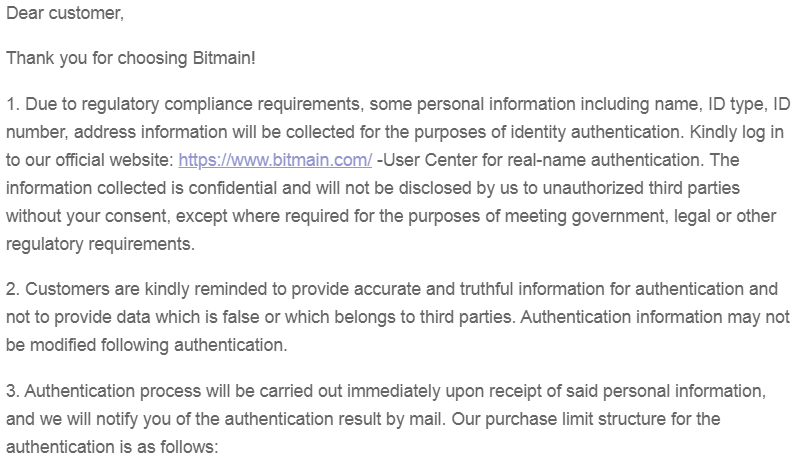
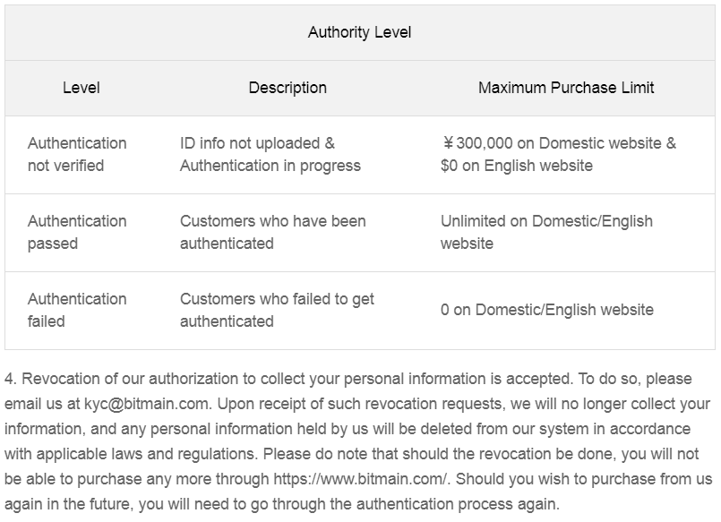

# Procurement
Procuring your miner can go really smoothly or it could quickly become a traumatizing experience. It depends on your ability to take your time, plan ahead, listen to your intuition, and take into consideration some important factors. The unfortunate truth is that there are scammers out there, they run legitimate looking websites, they respond to your emails, they'll take your money and run too. I nearly sent someone 0.26 BTC for an Antminer S19 Pro the day after Thanksgiving. I nearly ordered one off of Amazon too because they said it was in stock when the rest of the world had none.

Here's my advice, if you hesitate for even a second, that's your intuition trying to tell you something. Don't get in a rush. Take your time and reach out to someone you know for advice when you need it. 

Luckily for me there were a couple guys I knew well enough from Twitter & Telegram that I felt comfortable reaching out to them when I needed help, h/t [@Diverter_NoKYC](https://twitter.com/Diverter_NoKYC) & [@Crazyk_031](https://twitter.com/Crazyk_031).

They got me pointed in the right direction and now I'm giving that information to you. Start lurking in some of these Telegram groups:

- [Hardware Market Verified Listings](https://t.me/Hardwaremarketchannel) is the first place I would consider finding mining equipment ads that I would act on. This is the room I found the ad for my machine. The sellers in this channel have given their identifying information to the channel admin, CrypTech Solutions and they have a reputation to maintain. Although this adds a sense of security to the transaction, it is not a silver bullet against getting scammed so you do need to be careful. [@MineFarmBuy](https://twitter.com/minefarmbuy) & [@KaboomRacks](https://twitter.com/kaboomracks) post ads here often and they have good reputations. [@BlockwareTeam](https://twitter.com/BlockwareTeam) also posts ads there as well however, they have a strict 5 ASIC minimum now. So if you are ready to act on an ad, find it in this channel, even if there is a high minimum order quantity (MOQ) contact the seller anyways to get on their radar, they will often consolidate small orders. 

- [Home Mining Wizards](https://t.me/HomeMiningWizards) is a channel for hobbyists to share their home mining set ups and ideas on immersion, air-cooled mining, and more. 

- [Hardware Market](https://t.me/HardwareMarket) is a channel for buying and selling crypto mining hardware ads only, no mining or crypto discussions. This will give you an idea of what the market conditions are like, what availability there is, and who some of the big dealers are. Be careful about posting into this room that you want to buy an ASIC or two, you really open yourself up to scammers by doing that. I'm not saying the people in this room are scammers, but scammers lurk everywhere waiting for an opportune moment to strike. 

- [Miners Peak](https://t.me/minerspeak) this group is all about contributing positive content to the mining space, but discussion doesn’t have to be limited to mining. No buy or sell ads in this channel. 

- [Blockware Solutions Hardware/Hosting/Pools/Market](https://t.me/BlockwareSolutionsOfferings) this is a channel maintained by Blockware Solutions, they offer hosting services, sell equipment, and more. This is the company I bought my ASIC from. This can also be a good source for current events in the mining space. 

- [Kaboom Racks Marketplace](https://t.me/kaboomracks) this channel is where you can find ads to buy or sell mining equipment through Kaboom Racks. These guys also have a good reputation in the industry.

Between those six Telegram groups, you should be able to get a good "lay of the land" and start to see how procuring some mining equipment works. When I first joined these channels I just lurked for a few days and tried to get an idea for how things worked. I kept an eye on the Hardware Market Verified Listings channel until I saw an ad that met my criteria and then I jumped on it.

Another resource is [Upstream Data](https://www.upstreamdata.ca/asic-supply), this company specializes in pairing modular Bitcoin mining datacenters to natural gas engines as a creative solution for vented and flared natural gas at upstream oil and gas facilities. Recently, Upstream Data has started selling ASICs to individuals with a minimum quantity of 1. Additionally, Upstream Data is launching the "[BlackBox](https://www.upstreamdata.ca/black-box-presale)" which is designed to attenuate sound and be operated outdoors. This is a great solution to dealing with the noise and heat generated by ASICs. Full disclosure, I was affiliated with Upstream Data from December 2021 until December 2022.

What criteria suits your needs will depend on you and your unique situation. I decided to use some profits from cashing out some bitcoin and I set $5k aside for this project. I understood from Diverter's Mining for the Streets guide that right then was an excellent time to start mining because we just passed a halving event, we were on the precipice of a bull run, and the new generation of mining equipment is coming to market. So with these conditions combined, getting the best mining equipment I could afford with the highest hashrate meant that I would be able to maximize my results for a longer length of time. 

1) I wanted new equipment because I can't trust how used equipment was treated by the previous owner. 
2) I wanted the latest generation hardware so I could get the longest life expectancy. 
3) I wanted the highest hashrate I could afford so I could maximize my returns. 
4) I had a $5k budget for equipment & infrastructure. 

Given the market conditions and the long lead-time on ASIC's being delivered from the manufacturers, I narrowed my choices down to the Bitmain [Antminer S19 Pro](https://shop.bitmain.com/release/AntminerS19Pro/overview) or the MicroBT [Whatsminer M31s+](https://www.whatsminer.com/mall/parts/37.html). I had my chance to get the Whatsminer first when I saw [Blockware Solutions](https://twitter.com/BlockwareTeam) post an ad in the Market Hardware Verified Listings on Telegram with no minimum order quantity. 

I responded to the ad on Telegram and soon I was talking directly with [Mason Jappa](https://twitter.com/Mason_Jappa), he informed me of the anticipated lead-time, we agreed on a price, and as things progressed he was very good at keeping me up to date on changes in delivery dates and getting me all the information I needed to make this a smooth transaction. 

At this point, you may be wondering about maintaining your privacy, as you may have concerns over making Bitcoin related transactions that involve any of your personally identifiable information. I'm going to share with you how I tried my best to remain as anonymous as reasonably possible. It occurred to me some time ago that interacting with the world in a private manner was difficult. One tool I have found to help preserve my privacy was establishing a Limited Liability Company (LLC). Having an LLC allows me keep my personal information off of public records, bank wires, shipping labels, and various communications. In the case of procuring this ASIC, I was cognizant of the possibility that in some variation of a world controlled by a totalitarian regime, hell-bent on eradicating Bitcoin as it poses the opportunity of freedom for the many and threatens the sovereignty of nation-states, it may be best if my name and residential address were not tied to an ASIC Bitcoin miner purchase. All of my communications with Blockware Solutions were done via Telegram and Protonmail, I wired money from my business bank account which doesn't use my personal name or address on payments, my LLC is registered with an agent who filed the forms with the Secretary of State on my behalf so that my personal information is not on the public record, and I arranged to have Blockware Solutions deliver the ASIC to my business P.O. Box. 

I recommend considering your privacy and how it can be preserved. One other possible solution I explored was purchasing an Antminer S19 directly from Bitmain. Unfortunately, Bitmain requires a range of KYC information and that was an immediate red flag for me. Here is a screen shot of the email I received from Bitmain after creating an account with them:

I hope this section provided you with some good resources to get your ASIC hunt started. Between the day I committed to the decision to mine at home and the day I received my Whatsminer, 27 days had passed. Make sure you are planning ahead and not getting in a rush. This stuff takes time and haste makes waste. But while you're waiting, you have plenty to think about with the infrastructure you want to build.
