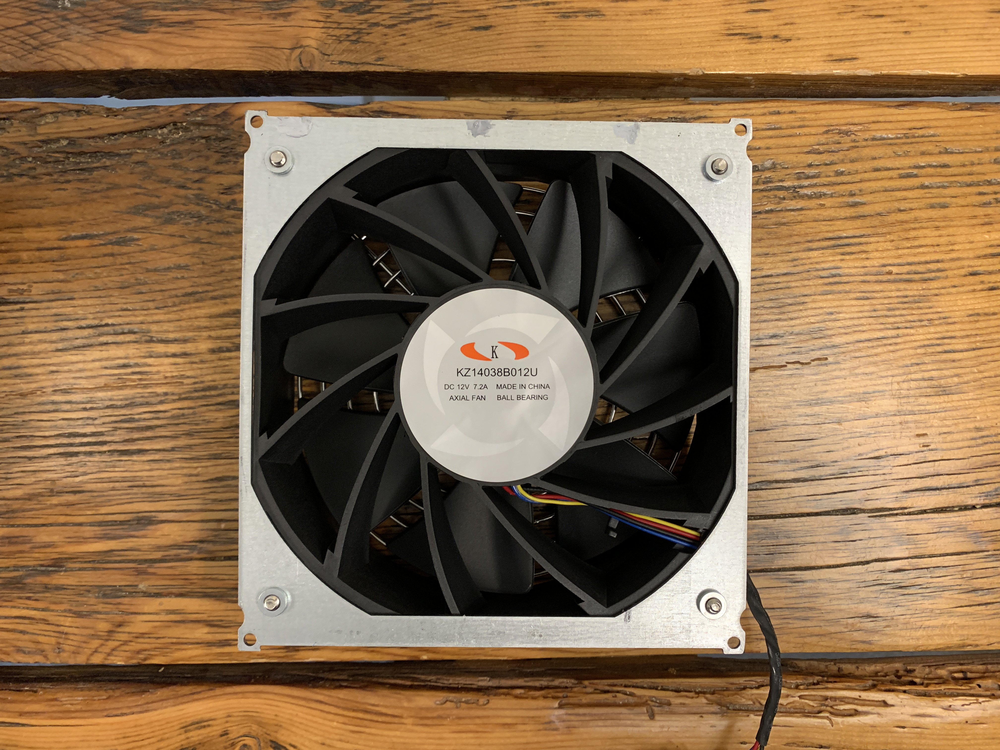
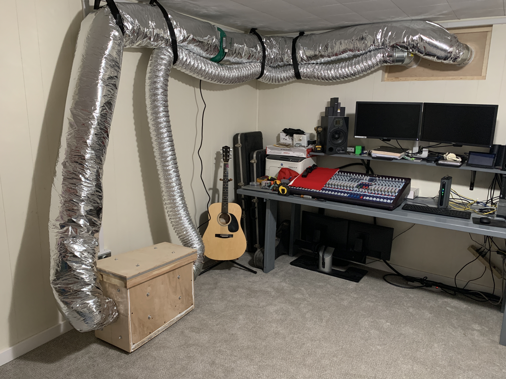

# Ventilation
There are a few options when it comes to keeping your ASIC's circuit boards cool; water-cooled blocks, oil submersion, and air flow are a few common ones. In this guide I'll be sticking with the stock air-cooled method as the machine was manufactured for. Keeping the circuit boards cool is of critical importance, overheating will cause increased down-time, decreased hashrate, and more expense in replacement parts. The fans do a good enough job keeping the machine cool but the trade off is that they are loud and they produce a lot of atmospheric heat. You may find some clever uses for the excess heat produced by your ASIC such as supplementing your home's central heating system. For the sake of getting this project moving along I chose to just duct the exhaust air outside to atmosphere. I may attempt to find a better use for it in the future. 

The fan diameter on this particular ASIC is 5.5", so in designing the ventilation system, I wanted to be sure that there was no restriction or bottle-neck in air flow bringing fresh air to the machine or exhausting hot air away from the machine. 

For this reason I went with a 6" diameter duct opening on both sides of the noise treatment enclosure. I also made sure that the center of the fans on both side of the ASIC were aligned with the center of the input and output vents in the enclosure.

In order to bring in fresh air and exhaust hot air, I was going to need to utilize the window in the room to do so. This is a basement room so the window is in a window well. First I removed the plastic guard from over the window well, pulled out all the weeds, and removed the loose dirt.

Next, in order to prevent dust from being sucked into the air intake vent, I put down three layers of 6mil plastic and then put a layer of small rocks on top of the plastic. This should also help prevent more weeds from growing in the window well. After that, I removed the window entirely and then cut out a piece of plywood to take it's place. Then I cut two 6" holes in the plywood so that I could run the intake and exhaust vents. From the inside of the room, I framed in the plywood to make it sturdy. 

For the exhaust vent, I ran an extension vertically to help keep the heat away from the intake vent. I put a weather guard cap on the top of the extension to help keep snow and squirrels and whatever else out of the duct work. After installing the vents, I placed some rocks around the window well to finish it off. 

On the inside of the room, I ran the inlet ducting in standard non-insulated flexible tubing. For the exhaust side, I ran it in insulated flexible ducting to help prevent radiant heat from warming up the inlet line and also to help keep the room from accumulating heat. 

After getting the enclosure connected to the duct work and running the ASIC, I was having trouble with the machine resetting every 15 - 20 minutes. The mining software was indicating that the fault was related to overheating. I realized that part of the issue was the sand bags not allowing air to flow around the body of the ASIC. But even after removing the sand bags, I was still getting overheating faults. It dawned on me that the fans on the ASIC were powerful but not powerful enough to fill a 20 foot run of 6" duct work with enough pressure to adequately push the hot air away from the ASIC fast enough. For this reason, I went to a hydroponic gardening center and purchased an in-line 6" hi-velocity fan to help evacuate that hot air. This fixed the problem immediately. 

I hope this section got you thinking about cooling options and the potential issues you may face when setting up an ASIC in your home. Be creative and remember that those who ask permission seek denial. 

Now that the electrical is ready, the noise treatment enclosure is ready, and the ventilation is ready; The long awaited process of producing my own non-KYC bitcoin can start. 
