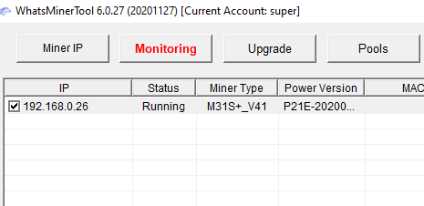
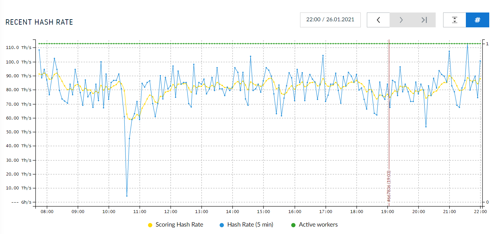

# Connecting to a mining pool
After all that hard work getting the necessary infrastructure installed, prepared, and tested; it's time to kick the tires and light the fires! The actual configuration of connecting the miner to a pool was by far the easiest part of all this. I was really surprised by how simple and straight forward it was. When I built my first Bitcoin full node on a Raspberry Pi, it took me 2 months to get it working. I have this incredible ability to turn any seemingly simple project into a bee's hive of problems. But truly, this was easy.

There are two ways to connect to your miner, the Whatsminer Tool or just using a web browser on your local network. In hindsight, I found using the web browser has become my preferred method. 

## Step 1: 
There needs to be a way to interface with the ASIC machine so that important information like hash rate and temperature can be monitored. The interface also allows the user to configure other important settings like which pool to point to. Download the Whatsminer software tool onto your PC. This can be found [here](https://www.microbt.com/server/firmware.html). I downloaded the WhatsMinerTool-6.0.27.zip. Make sure you check the manufacturer's website for the latest interface tool if this is the method you have chosen. If you have a different ASIC brand, then you will probably need to do something similar to get the interface specific to your machine from the manufacturer or just use a web browser. 

## Step 2: 
After unzipping, running the installation, and launch the application; simply click on "Start". This will tell the software to scan your homes local network for any ASIC's, so make sure your ASIC is powered on prior to starting the software. It will probably be necessary  to push the "IP Found" button on the back of the ASIC which will make it discoverable.

Once discovered, the information related to the ASIC will be displayed in the software, it's simply displayed like cells in a spreadsheet. This is where you can find all sorts of data on your ASIC such as Status, hashrate, temperature, local IP address, Watt consumption, and more. The "Start" button will turn to "Monitoring" once clicked.

Alternatively, if you are using the web browser interface method then you can log into your router on your local network and navigate to the DCHP settings to find the local IP address for all the devices on your network. Then you can take that IP address for your Whatsminer (or other ASIC) and type it into the URL bar in your web browser. For Whatsminers, the default username/password should be admin/admin or admin/1234. Be sure to check the documentation from your ASIC manufacturer for the correct credentials. Once logged in, I recommend updating the password from the default to something difficult to guess. Log out and back in again to double check that the changes have taken effect.

## Step 3:
Set up an account with a pool of your choice. Only [Slush Pool](https://twitter.com/slush_pool) will be covered here, which is the only pool I have personally tried so far, here is a link to their [website](https://slushpool.com/). [@Crazyk_031](https://twitter.com/Crazyk_031) recommended Slush Pool to me to start with. Once researching more into how it worked, I liked that there was a mobile app available to monitor the ASIC while on the go; the fee structure seemed fair in that block subsidy rewards plus mining fees from the transactions included in the rewarded block were disbursed to miners based on an average of hash power they contributed minus the 2% pool fee. And I also like the web interface. Additionally, SlushPool is not part of the Bitcoin Mining Council, which I think is a benefit and SlushPool has consistently acted in a manner that is more aligned with my personal opinions. SlushPool supported small blocks during the 2017 Block Wars and they were also the first pool to signal for Taproot activation. SlushPool also pushes development of the custom firmware, Braiins. 

I'm also signed up on the waitlist with [@laurentiapool](https://twitter.com/laurentiapool) so that when it launches I can try this one too. Unfortunately, something in the software with Laurentia Pool will not work with Antminers, so if you have one, you will not be able to mine with Laurentia. But the cool thing about a project like Laurentia is that the mining rewards are paid out directly from the coinbase to the mining operator. This means that the pool operator's wallet does not receive and hold the rewards prior to the 100 block confirmation. Mining operators with Laurentia Pool will still need to wait the 100 block confirmation period for their rewards to be spendable. The bigger picture here is that when KYC creep eventually starts effecting the way pool operators interact with mining operators and also effecting the information required to be collected; then projects like Laurentia Pool will provide a way to route around these kinds of choke points since the mining rewards are paid directly from coinbase to the mining operator. 

There are only two things needed to create the Slush Pool account: an email address and a Bitcoin address for the rewards to be deposited to. I would recommend to use an email address with no personally identifying information and to use a Bitcoin address that is not tied to any KYC information and that is completely segregated from any KYC'd funds you might have. I also recommend updating the Bitcoin address in between each payout so that you are not reusing it. As well as randomizing the payout amount each time to avoid patterns that could be used against you later. Then use [Samourai Wallet's](https://t.me/SamouraiWallet) CoinJoin implementation, [Whirlpool](https://t.me/whirlpool_trollbox) to break the deterministic links from the payout UTXO's and their origin at Slush Pool's wallet. In the near future we will see mining pools that require mining operators to KYC themselves in an attempt to create a white-market Bitcoin ecosystem that rejects transactions from black-listed addresses. I think that's a bunch of bullshit that will not end well for those who try to force legacy system regulations into Bitcoin. Anyways, I digress, once an account is set up, the dashboard has helpful charts so that the performance of the miner can be monitored. 

This is what the dashboard looks like once logged into Slush Pool, it prominently displays your ASIC's current hashrate, health, and your rewards. This snap shot was taken after running my ASIC for a total of 92 hours. I'll come back to this image and explain the operating costs/rewards in the next section.

There is also a cool graph that displays your active machines with the green line, your machine's scoring hash rate with the yellow line, and your machine's calculated share hash rate with the blue line. As an aside, coincidentally, the sharp dip around 10:30 am was actually when the electrical utility company replaced my old meter that charges $0.12/kWh 24-hours a day with my new meter that charges less during off-peak hours. 

That's a quick tour of the dashboard, Slush Pool also has a Demo Account feature where you can simulate running your own miner to see how everything works. Once you have your account all set up and you're familiar with the dashboard the miner can be pointed at Slush Pool.

Be sure to navigate to the Rewards section in your SlushPool dashboard and configure your bitcoin deposit address and payout threshold. This particular change will require email verification to take effect. 

Another consideration in pool selection can be overall network hashrate distribution. If one pool gets too much hashrate it could raise concerns of a 51% attack. Not that I think we'll ever see a 51% attack, I'm just saying that's the idea behind keeping the network hash power distributed.

## Step 4: 
Back in the Whatsminer software screen, click on the "Pools" button, this will display some dialog boxes where you can copy and paste the URL provided by your mining pool. 

Slush Pool offers V2 URL's to help make information transfer more efficient and encrypted to prevent MITM attacks and hashrate hijacking. The standard V1 URL's can also be used. A list of Slush Pool's V2 URL's can be found [here](https://help.slushpool.com/en/support/solutions/articles/77000423566). More in-depth information on Stratum V2 details can be found [here](https://insights.deribit.com/market-research/stratum-v2-migration-and-decentralization/) and [here](https://braiins.com/blog/data-privacy-and-security-for-bitcoin-miners). Make sure you enable any changes in the mining software configurations by saving them. Or in the case of the Whatsminer software by clicking on "Start Update".

Alternatively, if using the web browser interface then once you have your SlushPool account setup, you can copy/paste the pool URL found from the dashboard settings to your miner configuration page that you logged into through your web browser on your local network. Make sure to hit save after each change. If you change one parameter and move on to the next without hitting save first, then those changes will be lost. I recommend using a Stratum v1 URL unless you are running the Braiins Firmware. Also, use a URL that is more geographically aligned with your location, for example if you are in the US then use the "stratum+tcp://us-east.stratum.slushpool.com:3333" URL. After you have saved that URL then you need to update your worker name to reflect your SlushPool username. So this would look like "econoalchemist.worker1" for example. Then save that change. Next, the password used here can be anything and doesn't effect security, it could be "1234" if you wanted, it is just a way to prevent spam. Then save that change. You should have three fields in the configuration page where you can specify different pool URLs, personally I used this to store backup pool URLs in case a SlushPool server goes down, that way I have a redundant secondary pool URL and a tertiary one as well to help mitigate any downtime on my end. For example, my primary URL is the US East Coast one, then the Canadian one, then the General one. 

Once you have made all your modifications to the configuration page and saved them, then you must reboot your ASIC in order for the changes to take effect. Be patient and give your miner at least 30 minutes to get spun up to full hashing power and start reporting to the pool. Make sure you are also logged into your SlushPool dashboard so you can monitor the status of things from the pool's side as well as logged into your miner web browser interface to compare the status of things on your local side. 

And that's it, the ASIC is now pointed to Slush Pool and generating bitcoin rewards! The health and configurations of the miner can be viewed through the Whatsminer software tool or through your web browser. And pool specific details can be monitored from the Slush Pool dashboard.  

Just to recap:

1) Install the miner software.
2) Find the ASIC's local IP address.
3) Create an account with a pool.
4) Copy/paste the pool's URL into the mining software or web browser interface.
