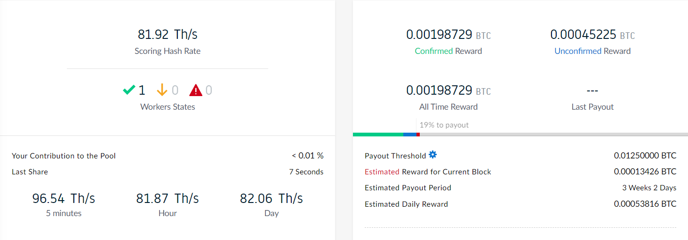
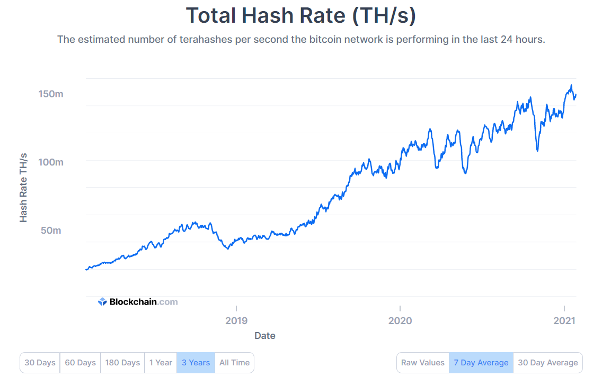
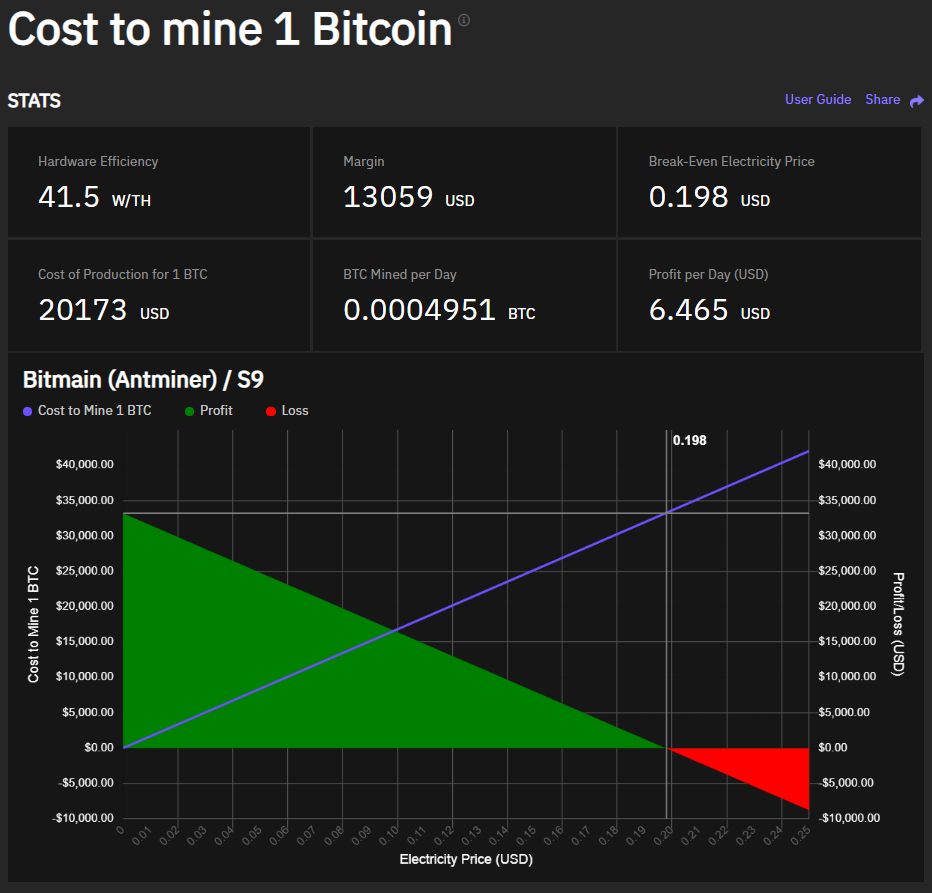
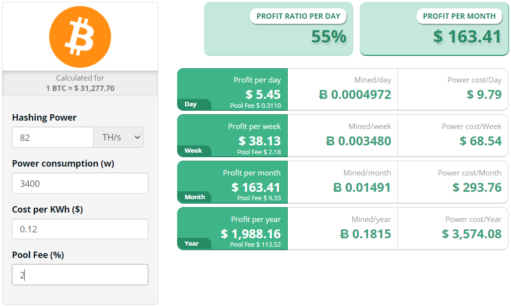
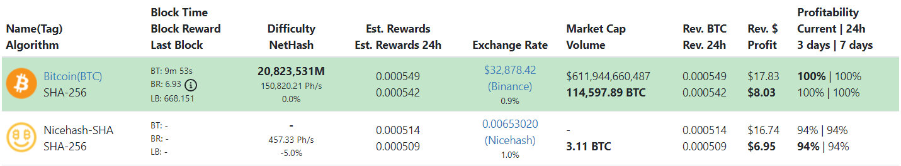
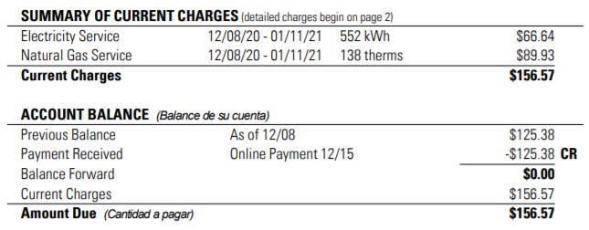

# Operating Costs/Rewards
The numbers don't lie, so let's look at some real data and see if mining at home can be profitable. My basic idea for mining at home for non-KYC bitcoin is that I'm dollar cost averaging through my electric bill. I fully intend on keeping the bitcoin rewards I earn from mining as opposed to selling the bitcoin to cover my costs. 

Because the bitcoin earned through mining rewards is non-KYC, I would be willing to pay a premium. Meaning that if my electrical costs were more than the value of the earned bitcoin, I would be willing to continue operating this way until a certain point. What percentage premium you would be willing to pay depends on your unique situation. 

But as you'll see, I'm not paying a premium. I'm actually getting bitcoin at a discounted rate by mining at home. This is counter-intuitive to the narratives that I assumed were true. Such as:

- "residential electrical costs are too high to profitably mine at home" 
- "you can't compete with industrial mining operations"
- "it would be better to just spend the money on a bitcoin exchange instead of the electricity"

Through my experience, I have found none of those narratives to be true. In fact, I have found the opposite to be true. KYC bitcoin is more expensive than non-KYC bitcoin and mining at home can be even cheaper than buying bitcoin through non-KYC exchanges. 

First and foremost, providing KYC information to trusted third parties exposes the user to unnecessary security vulnerabilities like we witnessed in the Ledger data-breach, imagine if the data at CoinBase was miss handled in some way... oh wait, they contract their services out to the IRS and DEA among other government agencies around the world, so never mind, they totally fuck your data. Putting a price on that is difficult to quantify but it is a price I am not willing to pay. Additionally, when the sovereignty of a nation-state is threatened, the ruling government will stop at nothing to mitigate the threat. People cheering on Bitcoin regulations because they think it will drive mass-adoption as if as though Bitcoin is some kind of Trojan horse that will do more damage from inside the system, are helping build a cage around the people using Bitcoin. The legacy system is broken, it has failed, central banks are rotting carcasses that have sustained parasitic scavengers for far too long; trying to force the old system into the new will only harm the end users. For every pro-KYC regulation or requirement or rule that is created another group of Bitcoiners are cornered because they didn't understand the danger of connecting their name and their Bitcoin address. 

On the other hand, Having non-KYC bitcoin that is not traceable to your identity; that is native to a decentralized, permissionless, censorship-resistant protocol, that cannot be stopped by any person, company, or government - that's powerful. That is the kind of power that is worth fighting for. It's freedom from living by someone else's rules, it's freedom from appealing to authority, it's freedom from being forced to live in this world through the lens of some oppressive fucker that doesn't give a shit about you or your family. You take control of your bitcoin and nobody gets to tell you "no" ever again, you're in charge & you make the rules.

 

That's all I'm going to say about the dangers of KYC and the benefits of non-KYC for now. But there is more that goes into the cost of KYC bitcoin that makes non-KYC bitcoin more affordable, there are actual financial costs. Take CoinBase for example, the information below can be found on their website [here](https://help.coinbase.com/en/coinbase/trading-and-funding/pricing-and-fees/fees).

With CoinBase not only will you expose yourself to the security risks of a third party having your personally identifying information and be sacrificing your freedoms, but you will also be paying fees:

- Want to wire USD to CoinBase? $10.00 flat fee plus your bank's wire fee.
- Want to deposit USD with a debit or credit card? The greater of either a flat rate ($2.99 above $100 USD) or a variable percentage which is 4% unless you qualify for a waiver.
- Want to use that USD to buy bitcoin? 0.5% spread fee.

Let's look at an example: Alice wants to buy 0.125 BTC, so does Bob. Alice decides to use CoinBase and Bob decides to use Bisq. 

| Participant | Alice         | Bob           |
|-------------|---------------|---------------|
| Exchange    | CoinBase      | Bisq          |
| Crypto      | BTC           | BTC           |
| Amount      | 0.125         | 0.125         |
| Fiat        | USD           | USD           |
| Index       | $30,350/1-BTC | $30,350/1-BTC |
| Price       | $3,793.75     | $3,793.75     |
| Method      | Visa          | Zelle         |
| CEX Fee     | $151.75       | $0.00         |
| Spread Fee  | $18.97        | $0.00         |
| DEX Fee     | $0.00         | $3.79         |

| Total Spent | $3,967.47     | $3,797.54     |
|-------------|---------------|---------------|

**Alice spent $166.93 more than Bob, or a 4.4% premium on top of loosing her freedom and privacy.** 

I'm making a broad assumption here that Bob was able to make his Bisq trade in parity with the USD/BTC spot price. In my personal experience with Bisq, that is a very reasonable assumption. Additionally, if Alice ever cashes out that bitcoin there will be an instant 25% capital gains tax imposed. Maybe Alice can offset some of the tax burden with deductions, allowances, or charitable contributions when filing her taxes. But the statutory capital gains tax rate stands at 25% for the vast majority of citizens in the United States. 

Even if Alice doesn't sell, her personally identifying information is now tied to that BTC. If the government wants to impose an unrealized capital gains tax or a 6102 style executive order, she will be liable. Boating accident, you say? Bullshit, that will only permanently freeze the BTC in Alice's address and that's a best-case scenario assuming she took preventative self-custody measures and removed the BTC off of CoinBase, otherwise it would have been confiscated without her consent by that point. If Alice claimed boating accident in the face of a 6102 order and that BTC ever moved, then, well straight to jail. What about CoinJoin, you say? Bullshit, breaking the deterministic links between Alice's known address and post-mix address will only create the technicality that the government cannot prove beyond a reasonable doubt that Alice is still in possession of that BTC. That does not mean she will be absolved of her liabilities for what she previously provably owned. Furthermore, Alice cannot technically prove that she doesn't own that BTC anymore either after she mixes it. Have you ever had a photo-radar speeding ticket? Have you ever tried to fight one? I mean, technically they can't prove it was you behind the wheel but are you still liable? Did the fact that they couldn't technically prove you were driving the vehicle at the time of the violation absolve you of the fines associated with that violation? Alice's best option was to never KYC in the first place. Her second best option is to provably sell the BTC the same way she bought it and then find a non-KYC on-ramp to get back into Bitcoin.  

Lets continue with the data from the example above and see how much it would cost to mine 0.125 non-KYC bitcoin at home with my setup. We already saw that non-KYC can be less expensive than KYC bitcoin, but can mining at home for non-KYC bitcoin be even less expensive than that?

The screenshot of my Slush Pool dashboard above was taken after running my Whatsminer for 4 days 17 hours. The unconfirmed rewards are as good as mine, but technically there needs to be a certain number of block confirmations before they are confirmed as mine. I am going to include them in my total mining rewards for the 4 days 17 hours my miner has been active. The 2% pool fee is already subtracted from my rewards, so what I see is what I get.  

Let's unpack this information: 

- 4 days 17 hours is a total of 113 hours.
- 0.00198729 confirmed BTC + 0.00045225 unconfirmed BTC = 0.00243954 total BTC.  
- 0.00243954 / 113 = 0.0000215 BTC per hour 
- 0.125 / 0.0000215 = 5,814 hours 
- 5,814 / 24 = 242 days
- 242 days = 7 months 3 weeks to mine the same 0.125 BTC amount that Alice & Bob bought.

Now that the amount of time has been calculated, the cost to mine can be calculated since my electrical costs and miner consumption are known.

- $0.12/kWh x 3.4kW =  $0.408 per hour to run the miner. 
- 0.408 x 5,814 = $2,372.11 to mine 0.125 BTC that cost Bob $3,797.54.

**Bob spent $1,425.43 more than me, or a 60% premium for 0.125 BTC.**

Bob got his BTC all at once where it took me 7 months 3 weeks, so urgency may have it's price. 

Let's look at return on investment (ROI) since my Whatsminer wasn't free. I paid $2,850 USD for my Whatsminer. The hardware market is constantly changing and it will take some patience and obsessive observation of the Telegram channels to find what you are looking for. ASIC manufacturer supply delays coupled with the Bitcoin bull market have created a market where there is more interest in mining than there is mining hardware available. It is natural that in these conditions the ASIC prices will rise.  

Calculating ROI is a moving target, especially when throwing the USD conversion in the mix because the USD/Bitcoin index is volatile and so is the Bitcoin network hash rate. As the USD price for BTC rises my ROI time period is shortened. But as network hashrate rises my mining rewards will diminish. Since I'm paying my electric bill in USD, this is a necessary consideration. 

The chart below shows the over all network hashrate, it can be volatile but in general it is only headed in one direction. As the network hashrate grows, the static contribution from my ASIC becomes a smaller percentage of that total hashrate and thus on average my rewards become smaller as well.

I could just take a snap shot of today's market conditions and speculate:

- $30,350 USD per 1 BTC
- $9.79 per day in electrical costs
- 0.000516 BTC rewards per day
- $15.66 value of daily rewards
- 15.66 - 9.79 = $5.87 profit per day. 
- 2,850 / 5.87 = 485 days for the profits to pay off the initial investment. 

My math is rough at best. Slush Pool is estimating my daily rewards to be 0.00053816 BTC per day. Plugging that number into the above logic reduces my ROI from profits to 435 days. But it's important to realize that concurrently with generating these profits I will be DCA'ing ~$300/mo into non-KYC bitcoin.  

This exercise can be exhausting since it is based on several changing variables. Another way to think of it is that it would take me 1,855 days to mine 1 BTC with today's network hashrate. At $9.79 per day in electrical costs, that means that so long as BTC is trading above $18,160.45 then I should remain profitable. 

Another way to think of it is that if I had bought BTC instead of the Whatsminer at the beginning of December, I would have 0.15355603 BTC since it closed at $18,560 that day. With BTC trading at $30,350 today, that means 0.00019341 BTC of my daily rewards are profit. It would take 794 days ROI in these market conditions.  

Here are a few mining calculators, try these out to get an idea for whether or not home mining may work for you:

[Braiins Mining Calculator](https://insights.braiins.com/cost-to-mine)

[CryptoCompare Mining Calculator](https://www.cryptocompare.com/mining/calculator/btc)

[What To Mine Mining Calculator](assets/https://whattomine.com/asic)

At the time of writing, my electrical utility provider has just installed a peak-demand meter per my request. The impact this has on my electric bill is yet to be seen as it was just installed and the new charges have not been billed out yet. However, with my standard meter I was being charged $0.12/kWh which I figured by taking my total billed electricity divided by the number of kW hours consumed.

With the peak-demand meter, I should be charged $0.11078 per kWh from 14:00 until 18:00. Then from 18:01 until 13:59 I should be charged somewhere between $0.05539 per kWh and $0.08309 per kWh. But I won't know the exact rates until my next bill. But what this means is that the cost to operate my ASIC should look like these examples showing a couple different Watt consumption rates to give a range:

Old Meter Rate of $0.12/kWh @ 3,400W = $9.79
Old Meter Rate of $0.12/kWh @ 3,600W = $10.37

Peak-Demand Scenario 1 @ 3,400W = $5.27
Peak-Demand Scenario 1 @ 3,600W = $5.58

Peak-Demand Scenario 2 @ 3,400W = $7.24
Peak-Demand Scenario 2 @ 3,600W = $7.58

If I get the kind of cost savings I am anticipating, it could potentially reduce my ROI time period to as little as 258 days. So I will be monitoring the changes in my electric bill that the new meter has. If mining hardware costs continue to rise, don't jump to the conclusion that you are being priced out of the market. Try to make careful considerations about your situation, your long term goals and how KYC effects that. You may just find that home mining for non-KYC bitcoin may have a high initial cost but it could save you in many other ways down the road. 

I hope this section brought you some clarity about the operating costs and the rewards involved with home mining for non-KYC bitcoin. I tried to highlight the importance of non-KYC and the things a person stands to lose when they opt for the KYC option. As well as making the case for KYC being more expensive than non-KYC and home mining being the most economical of all the options in addition to the safest and most privacy preserving option. 
