# Questions & Answers
In this section I answer questions that were asked when I started posting about this project on Twitter [here](https://twitter.com/econoalchemist/status/1341530135548186625) & [here](https://twitter.com/econoalchemist/status/1345643451207991296).

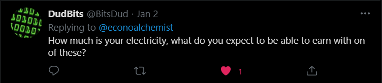

My electricity costs were $0.12 USD per kWh until I requested a Peak-Demand meter from my utility provider. The Peak-Demand meter charges two different rates, one is ~$0.11/kWh during peak energy demands (14:00 - 18:00 daily). The second rate is somewhere between $0.055 - $0.08/kWh. I just had the new meter installed as I was writing this article so I will have to wait until my next bill to see the exact rates. Under current market conditions, I anticipate earning ~0.00055 BTC per day.

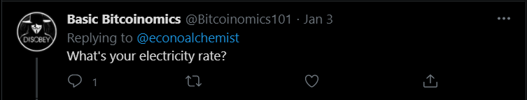

~$0.11/kWh during peak energy demands (14:00 - 18:00 daily). And between $0.055 - $0.08/kWh during off peak hours. I should have exact costs within the next month or so.

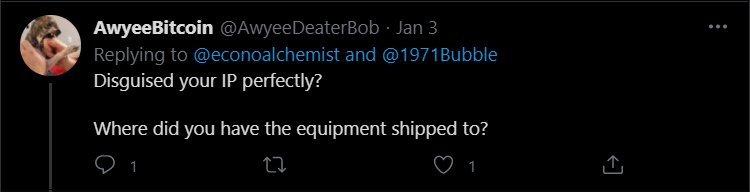

I'm not sure what qualifies as a perfectly disguised IP, but in any case I have not taken any additional precautions to conceal that information. Honestly, I wouldn't even know where to start, I am not the guy to talk to about network privacy, the first person who comes to mind for that discussion is @nixops. I know that Slush Pool is working on their v2 development and from what I understand that will help increase data efficiency and encrypt that information. Whether or not that has anything to do with disguising an IP address, I don't know. When I log onto the Slush Pool website to manage my mining dashboard, it connects via CloudFlare, I imagine the workload between my miner and Slush Pool is also routed through CloudFlare but that is a guess. This article seems to imply that a home miner can achieve better privacy from their ISP by "[using] any DNS proxy that supports encrypted DNS protocols such as DNSCrypt v2 and DNS-over-HTTPS to achieve much better privacy for their mining operations. Combined with Stratum V2, this is the mining equivalent of browsing the web with a VPN and only visiting HTTPS domains." 

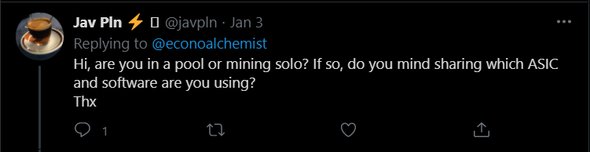

Hello, I pointed my miner at Slush Pool to start. I plan on giving [@laurentiapool](https://twitter.com/laurentiapool) a try when they get launched. Solo mining seems like playing the lottery to me, where as mining with a pool seems more like a game of averages. I could be wrong, but that's my thoughts. I am using a Whatsminer M31s+ with the standard Whatsminer Tool Software. You're welcome :)

Whatsminer M31s+

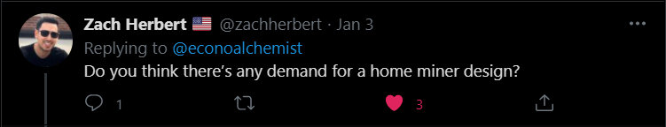

If we're talking about getting another ASIC manufacturer started, yes, 100%. And if you do it, then be the guy who stood up for privacy and fight to sell your equipment without the requirement of collecting KYC information. There are not enough ASICS available. But if we're talking about making some kind of Casa-style home miner that looks cute but doesn't have any horse power under the hood, then no. People who understand the value in mining at home for non-KYC bitcoin will make the necessary arrangements to accommodate the noise and the heat and what ever other problems arise. 

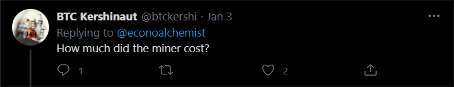

$2,850.00 USD. But a lot has changed since early December 2020 when I paid for my machine, and prices have changed a lot too. If you are serious about an endeavor like this I would recommend spending as much as you can afford to get the best equipment you can find. If you want this to generate a ROI, then I think you will spend at least $3,000 on a decent piece of hardware. 

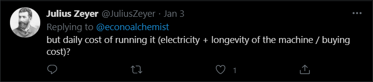

$10/day x 1,825 days (?) / $2,850 = 6.40. The long answer is that I anticipate the Whatsminer M31s+ to last a long time. The guy who designed the industry standard S9, which is still being used widely throughout the network, now works for Whatsminer instead of Bitmain. He designed the M31s+ and I think it will be a work horse well into the next halving, if not through it.

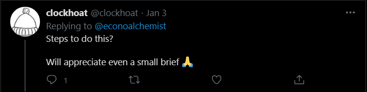

Brevity is not my strong suit, but I'll try: Find a seller, don't get scammed, pay for it with bitcoin if possible, have it shipped to a PO Box, make the necessary electrical upgrades if any, make the necessary noise/heat treatment considerations for your family/roommates/neighbors if necessary, plug it in and point it at a pool, send the mining rewards to an address that's not affiliated with your identity, change receiving addresses between each reward. More details can be found [here](https://www.econoalchemist.com/post/home-mining-for-non-kyc-bitcoin#viewer-foo).

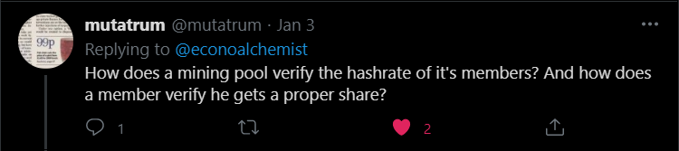

The short answer is:

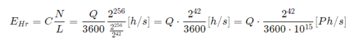

The long answer is that Slush Pool publishes the data used to figure out that exact question on an hourly basis. They also provide the python script to help crunch the data. I have not tried this myself yet, but as I get more familiar with this stuff I may dive into it. More information can be found [here](https://help.slushpool.com/en/support/solutions/articles/77000433900-hash-rate-proof), [here](https://old.slushpool.com/stats/hashrate_proof/), and [here](https://slushpool.com/static/hashrate_proof/proof.py).

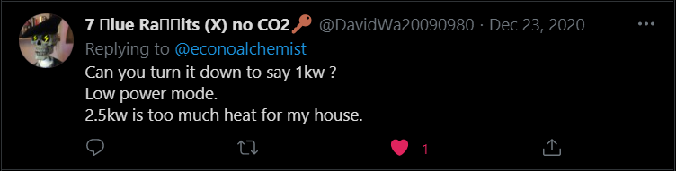

I did not see anything in the Whatsminer documentation that indicated the power consumption could be turned down. I know that [@braiins_systems](https://twitter.com/braiins_systems) is working on developing firmware for the Whatsminers but it will take some time to be released. This firmware might have the ability to control power consumption. Get on [Telegram](https://telegram.org/) and follow the teams' development in their channel [here](https://t.me/BraiinsOS). 

Please check [here](https://econoalchemist.com). 

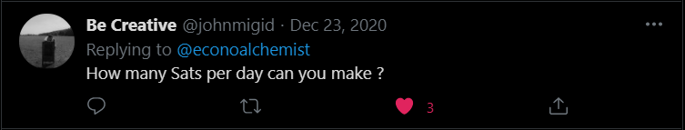

In the current market, ~55k sats daily. This number goes down for me as network hashrate goes up and vis versa so it is always a moving target.

With market conditions as they are currently, no premium at all. I'm actually getting bitcoin with roughly a 50% discount.

Yes. FML.

But in all seriousness, running an ASIC in the open air is quite loud. The Whatsminer M31s+ was running at about 85dB, which according to a [Purdue University chart](https://www.chem.purdue.edu/chemsafety/Training/PPETrain/dblevels.htm#:~:text=Car%20wash%20at%2020%20ft,garbage%20disposal%20(80%20dB).&text=2%20times%20as%20loud%20as,damage%20in%208%20h%20exposure.), is about as loud a diesel locomotive traveling 45 miles an hour at a distance of 100 ft. 80dB is roughly the threshold of sustaining damage to the human ear. This noise level was one of the motivating factors in the noise treatment enclosure I built. My enclosure reduced the noise level roughly 10dB, which as perceived by humans, sounds like a reduction in noise by one half.

Yes. But I am even luckier to not have my identity tied to the bitcoin I mine.

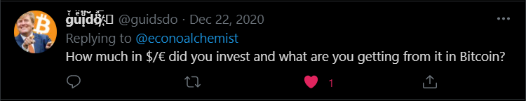

All in; including hardware, infrastructure, & everything, I spent just under $4,000.00 USD. The hardware alone was $2,850. In terms of Bitcoin I'm getting roughly 55k sats a day in these market conditions.

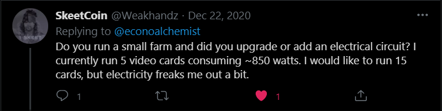

I only have the one machine. I did add an electrical circuit to make this project a reality. I would recommend hiring a professional electrician. Especially if anything in this image looks foreign or doesn't make absolute 100% sense to you. Otherwise you will electrocute yourself trying to do it on your own. 

Just make sure the electrician you hire is not a scammer and use the same level of common sense you use when dealing with online strangers. 

Stay safe out there.  

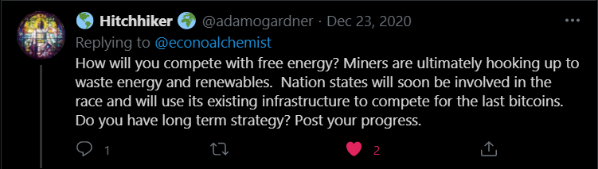

The phrase that comes to mind here is "if you don't want to lose, don't play the game" or something to that effect. What I'm trying to say is that I will not compete with other miners, it would be impossible for me, as a single ASIC, to be competitive. Are other miners getting free electricity? Yes. Do those miners give a shit about efficiency? No. Do they need to sell their bitcoin in order to support their operation? Maybe, if the energy is free then they probably don't need to sell much until they need to replace equipment. Now, as a single home miner, I pay residential costs for my electricity, I care a lot about efficiency, and I do not want to sell any of my bitcoin to sustain my operation. So my goals are totally different than the industrial miners, I want to DCA into some non-KYC through my electric bill. I don't really have a long term strategy, I will mine for as long as I can. At the moment, I'm getting roughly 50% discount on my bitcoin by mining it at home. If the network hashrate goes up and my mining rewards go down and the price of BTC gets so low that I'm spending more on electricity than the sats are worth; then I would be willing to pay that premium until a certain point. But at some point the money spent on electricity would just be better spent through a non-KYC on-ramp like [@bisq_network](https://twitter.com/bisq_network). But things would have to change significantly from the current state of the market and it would have to be in a bad way before I would be driven to stop mining. 

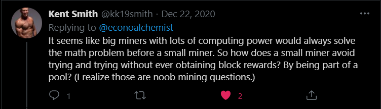

Correct, there is strength in numbers. By joining a pool I am contributing hash power to a group of miners and with our power combined we, as a collective group, have a higher probability of solving a block. On average, my rewards will reflect the percentage of the total pool's hashrate that my machine contributed. 

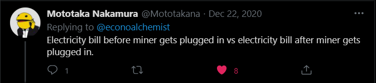

It will take some time to gather this data, but here is our current electric usage chart with my prediction drawn in:

  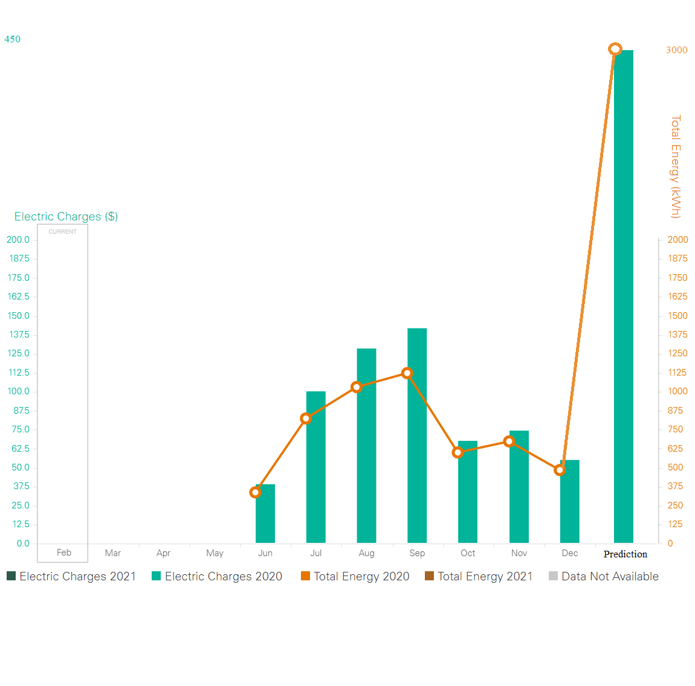

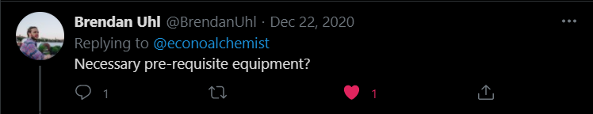

Everyone's situation will be different but you will definitely need internet, a PC, 240v power supply with the correct electrical connectors and rated power cable, and a way to ventilate fresh cool air at a bare minimum. Depending on how elaborate you want to get with ventilation or noise treatment or even oil/water cooling is totally up to you and your specific situation.  

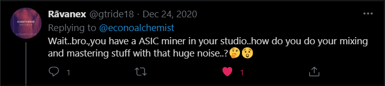

When need be, I can simply turn the ASIC off. 

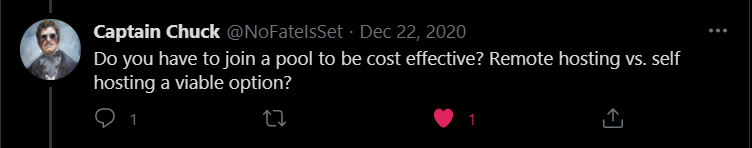

I think so, yes. If I did not join a pool I doubt that I would earn any bitcoin at all. Yes, remote hosting is a viable option for some people. One of the guys who helped me get started down this path is using a remote hosting option and he is happy with it h/t [@Crazyk_031](https://twitter.com/Crazyk_031). Contact [@BlockwareTeam](https://twitter.com/BlockwareTeam) for more information on hosting services. 

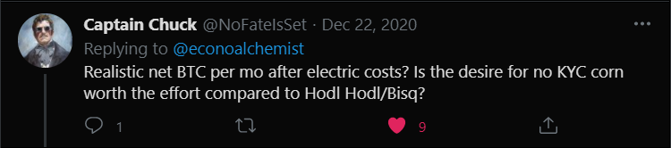

~0.0078 BTC net after electric costs are deducted. As far as the effort, in my opinion, yes. I still use Bisq, mining at home for me is not a replacement for Bisq it is merely a way to supplement my stacking with dollar cost averaging through my electric bill. 

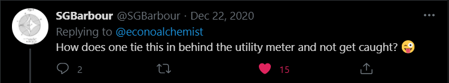

lol, I plead the 5th!

In the current market, a little over a year. And that is paying for just the hardware costs with just the profits. 

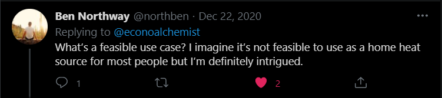

My use case is to slowly and steadily accumulate more of the censorship-resistant, permissionless, fuck-you-money. I imagine the heat could be used to supplement a home's heating system. 

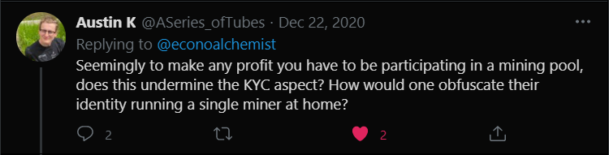

So to be profitable, yes I did join a pool. However, the only information the pool collected from me was an email address. I made sure to use receiving addresses for my reward payouts from a non-KYC wallet, which I keep completely segregated from a KYC wallet I have. Additionally, someone mining at home may want to consider their ISP as an adversary. [This](https://braiins.com/blog/data-privacy-and-security-for-bitcoin-miners) article has information on using DNS and Stratum v2 where possible to help.  

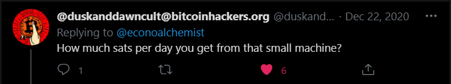

~55k sats. But this is subject to change based on overall network hash and other variables. 

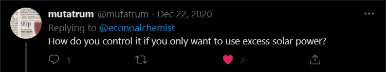

You would need roughly a 23kW photovoltaic (PV) solar system, according to this calculator. I based that on the fact that my average home energy consumption is roughly 500kW per month. My Whatsminer M31s+ will add an additional 2,500 kW to that consumption.  

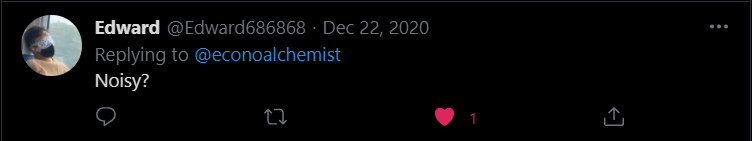

Yes, about 83dB without any noise treatment. About 72dB with the noise treatment enclosure.

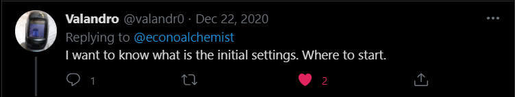

I would start with [Diverter's guide](https://github.com/econoalchemist/Home-Mining/blob/main/assets/Mining-for-the-Streets.pdf) and the [Verified Listings](https://t.me/Hardwaremarketchannel) Telegram channel. Once you get a machine, download the manufacturers software tool and the default settings should be fine to start. Figure out which mining pool you want to join and add that URL to your software tool and you're good to go. Connecting to a pool was the easiest part of all this. It really is just plug & play.

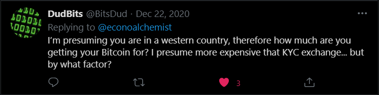

I am in the USA, the most western of all the countries ;) As of writing this, BTC spot price is $33,840 USD. So the 55k sats I stacked today are worth $18.62 but I only paid $9.79 in electricity costs. So this roughly 50% less expensive than a KYC exchange, plus I did not pay any fees to the exchange, or a spread, or reveal any of my personally identifying information. 

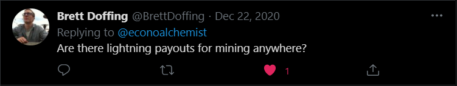

Not that I could find. 

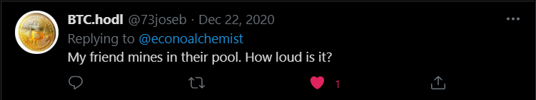

Roughly 83dB before the noise treatment enclosure and about 72dB after.
