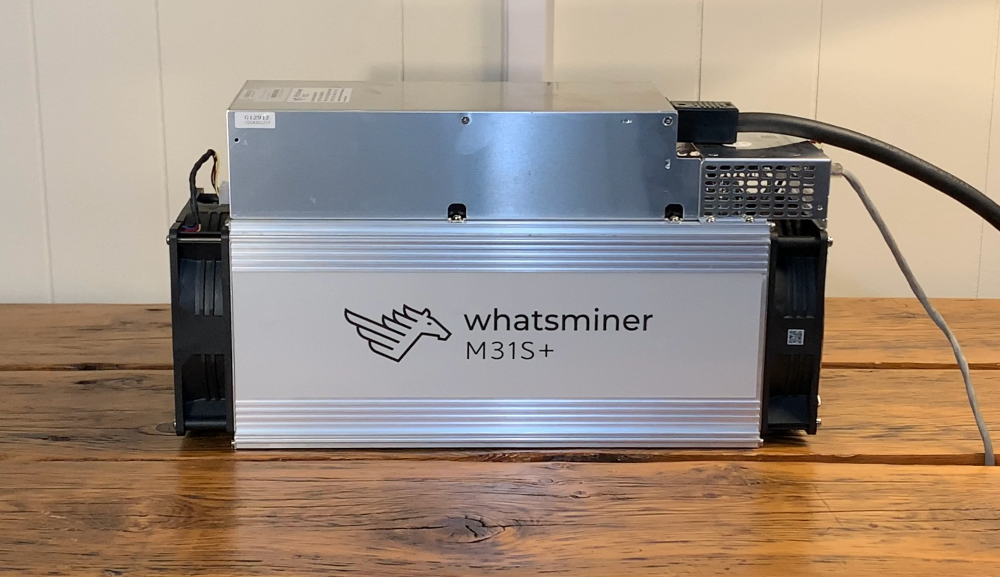

# Home mining for non-KYC Bitcoin
An article on setting up an ASIC Bitcoin miner at home with the goal of generating a non-KYC stack. Procurement, electrical infrastructure, ventilation requirements, noise treatment, connecting to a pool, and operational costs/rewards will be covered here. Additionally, community questions from Twitter are answered individually at the end. Several additional resources are presented as well.

If you're reading this, you probably have a basic understanding of what role Bitcoin mining plays in the ecosystem, approximately how it works, and the evolution of mining hardware to the modern-day ASIC machines. I'll be jumping straight into how to mine at home but if you are interested in the basics and history of mining, follow the links [here](https://en.wikipedia.org/wiki/Bitcoin#Mining), [here](https://www.coindesk.com/rise-of-asics-bitcoin-mining-history) and [here](https://nakamotoinstitute.org/mempool/the-proof-of-work-concept/).

Have you ever considered mining Bitcoin at home? Maybe you have but were deterred by naysayers telling you that home miners cannot compete with industrial-sized players. Or maybe you heard it's too complicated to configure your own setup. Or that residential electrical costs make it so that you will never be profitable.

Join me as I set out to put the FUD to the test and find out for myself what the truth of the matter is. You know how the saying goes, "Don't trust, verify". For as long as I've been interested in Bitcoin, mining struck me as a crucial piece of the network that I just didn't understand, it just seemed out of reach from a technical understanding and from an ability standpoint. I made assumptions that resonated with the naysayer's narratives and chalked it up to another missed opportunity. But that changed in November 2020 when I read a home mining guide by [@diverterNoKYC](https://twitter.com/Diverter_NoKYC) called <a href="assets/Mining-for-the-Streets.pdf" target="_blank" rel="noopener noreferrer">Mining for the Streets</a>. Diverter's guide offered a totally fresh perspective on what I thought I knew about mining. I was convinced after reading Mining for the Streets that home-mining for non-KYC Bitcoin was a goal within my reach. I highly recommend starting with Mining for the Streets. If you have had an interest in mining at home but have been told it's not profitable then his guide will change your mind.

I'm living proof that where there is a will, there is a way. A little bit of ambition, creativity, patience, and resourcefulness can go a long way. Those who are willing and able to put in the work and solve some problems will reap the benefits. Here is how I routed around the FUD and reached my goals, I hope you find some of these resources helpful and some of these ideas thought provoking. This article is organized by the following sections:

1) Procurement 
2) Electrical 
3) Noise Treatment 
4) Ventilation 
5) Connecting to a pool 
6) Operating costs/rewards 
7) Questions & Answers 
8) Resources 
